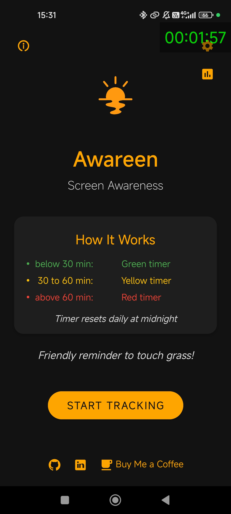
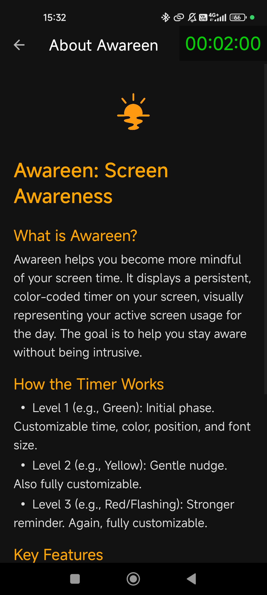
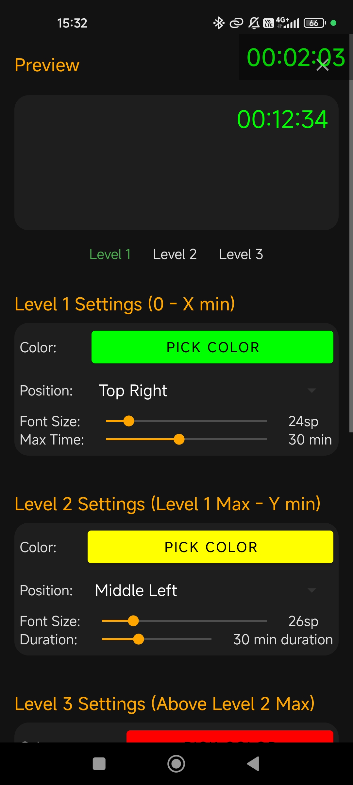
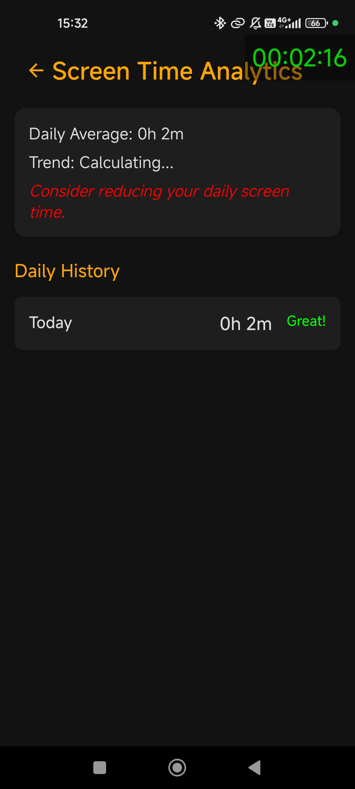

# Awareen - Screen Time Awareness App

**Awareen** (Awareness + Screen) is an Android application that helps users become more aware of their screen time through a persistent overlay timer. The app displays your current screen time in real-time, even when using other applications, promoting mindful device usage.

## 🚀 Features
- **Persistent Overlay Timer**: Always-visible screen time counter that works across all apps
- **Three-Level Alert System**: Progressive visual warnings based on usage time
- **Customizable Display**: Adjustable colors, positions, and font sizes for each level
- **Smart Display Modes**: Choose between always-on or interval-based timer display
- **Analytics Dashboard**: Track your daily screen time patterns and trends
- **Auto-Reset**: Configurable daily reset time for screen time tracking

## 📸 Screenshots
<p align="center">
  
  
  
  
</p>


## 📱 How It Works

### Three-Level System
1. **Level 1 (Green)**: Default display for normal usage (0-30 minutes)
2. **Level 2 (Yellow)**: Warning phase when approaching time limits (30-60 minutes)
3. **Level 3 (Red)**: Alert phase for excessive usage (60+ minutes) with optional blinking

> Colors and time thresholds are fully customizable in the settings.

### Display Modes
- **Always Mode**: Timer constantly visible on screen
- **Interval Mode**: Timer appears periodically (configurable intervals)

## 🛠️ Technical Stack

- **Language**: Kotlin
- **Min SDK**: 26 (Android 8.0)
- **Target SDK**: 35 (Android 15)
- **Architecture**: Service-based with overlay permissions

## 📋 Prerequisites

- Android 8.0 (API level 26) or higher
- Overlay permission (System Alert Window)
- App-pausing permission
- Battery optimization exemption (recommended)
- Auto-start permission (recommended)

## 🔧 Installation

1. **Clone the repository**
   ```bash
   git clone https://github.com/yourusername/awareen.git
   cd awareen
   ```

2. **Open in Android Studio**
   - Import the project into Android Studio
   - Sync Gradle files

3. **Build and Install**
   ```bash
   ./gradlew assembleDebug
   adb install app/build/outputs/apk/debug/app-debug.apk
   ```

## 🎯 Usage

1. **Grant Permissions**: 
   - Launch Awareen
   - Press "Start Service" to request necessary permissions

2. **Customize Settings**:
   - Access settings through the gear icon
   - Adjust colors, positions, and time thresholds
   - Configure display modes and reset times

3. **View Analytics**:
   - Check your usage patterns in the Analytics section
   - Track daily screen time trends

## ⚙️ Configuration

### Default Settings
- **Level 1**: 30 minutes (Green, Top Right, 24sp)
- **Level 2**: 30 minutes duration (Yellow, Middle Left, 26sp)
- **Level 3**: Unlimited (Red, Middle Center, 28sp, Blinking enabled)
- **Reset Time**: Midnight (00:00)
- **Display Mode**: Always visible

### Customization Options
- Timer colors and positions for each level
- Font sizes (adjustable per level)
- Time thresholds for level transitions
- Display intervals and durations
- Daily reset timing
- Blinking alerts for Level 3

## 🏗️ Project Structure

```
app/src/main/
├── java/com/example/screentimetracker/
│   ├── MainActivity.kt              # Main app entry point
│   ├── ScreenTimeService.kt         # Core service for tracking
│   ├── SettingsActivity.kt          # Settings configuration
│   ├── AnalyticsActivity.kt         # Usage analytics display
│   ├── InfoActivity.kt              # About/info screen
│   ├── AppSettings.kt               # Constants and defaults
│   ├── BootReceiver.kt              # For auto-start on boot
│   └── UnsavedChangesDialog.kt      # Settings dialog
├── res/
│   ├── layout/                      # UI layouts
│   ├── drawable/                    # Icons and graphics
│   ├── values/                      # Strings, colors, themes
│   └── xml/                         # Backup and data rules
└── AndroidManifest.xml              # App permissions and components
```

## 🔐 Permissions

```
   <!-- Overlay permissions -->
    <uses-permission android:name="android.permission.SYSTEM_ALERT_WINDOW" />
    <uses-permission android:name="android.permission.ACTION_MANAGE_OVERLAY_PERMISSION" />

    <!-- Boot and startup permissions -->
    <uses-permission android:name="android.permission.RECEIVE_BOOT_COMPLETED" />
    <uses-permission android:name="android.permission.QUICKBOOT_POWERON" />

    <!-- Foreground service permissions -->
    <uses-permission android:name="android.permission.FOREGROUND_SERVICE" />
    <uses-permission android:name="android.permission.FOREGROUND_SERVICE_DATA_SYNC" />
    <uses-permission android:name="android.permission.FOREGROUND_SERVICE_SPECIAL_USE" />

    <!-- Battery optimization and doze mode permissions -->
    <uses-permission android:name="android.permission.REQUEST_IGNORE_BATTERY_OPTIMIZATIONS" />
    <uses-permission android:name="android.permission.WAKE_LOCK" />
    <uses-permission android:name="android.permission.DISABLE_KEYGUARD" />

    <!-- Auto-start and background permissions -->
    <uses-permission android:name="android.permission.GET_TASKS" />
    <uses-permission android:name="android.permission.REORDER_TASKS" />
    <uses-permission android:name="android.permission.KILL_BACKGROUND_PROCESSES" />


    <!-- Network permission -->
    <uses-permission android:name="android.permission.INTERNET" />

    <!-- Notification permissions -->
    <uses-permission android:name="android.permission.POST_NOTIFICATIONS"/>
    <uses-permission android:name="android.permission.VIBRATE" />
```

## 🐛 Troubleshooting

### Common Issues

**Timer stops working**:
- Check if overlay permission is granted
- Disable battery optimization for Awareen
- Ensure the service is running in foreground
- Ensure the app pause is disabled

## 🤝 Contributing

1. Fork the repository
2. Create a feature branch (`git checkout -b feature/amazing-feature`)
3. Commit changes (`git commit -m 'Add amazing feature'`)
4. Push to branch (`git push origin feature/amazing-feature`)
5. Open a Pull Request

## 👨‍💻 Author

**Andrei Gulin**
- GitHub: [@Andebugulin](https://github.com/Andebugulin)
- LinkedIn: [Andrei Gulin](https://www.linkedin.com/in/andrei-gulin)

## 🔄 Version History

- **v1.0.0**: Initial release with core overlay functionality
- Features: Three-level system, customizable display, analytics tracking

## Support My Work

If you find this app useful, consider supporting me:

<a href="https://www.buymeacoffee.com/andebugulin">
  
</a>

You can also find the premium version with additional features on [Gumroad](https://your-gumroad-link.gumroad.com/l/screentimetracker).

## Connect with Me

- [GitHub](https://github.com/Andebugulin)
- [LinkedIn](https://www.linkedin.com/in/andrei-gulin)

## License

This project is licensed under the MIT License - see the LICENSE file for details.