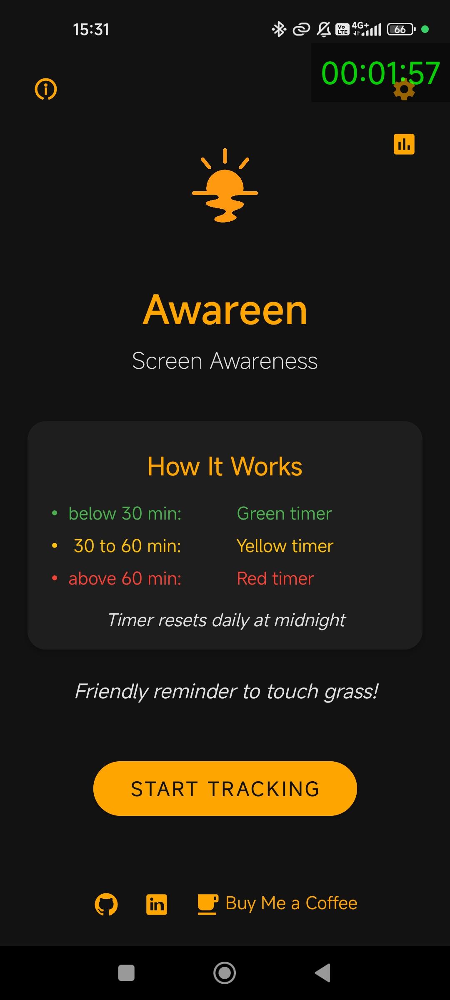
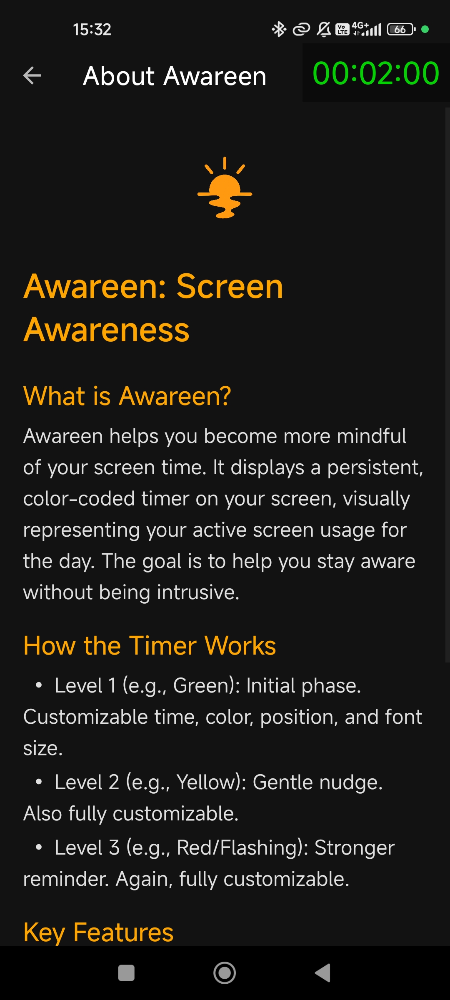
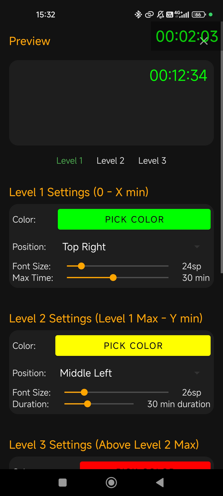
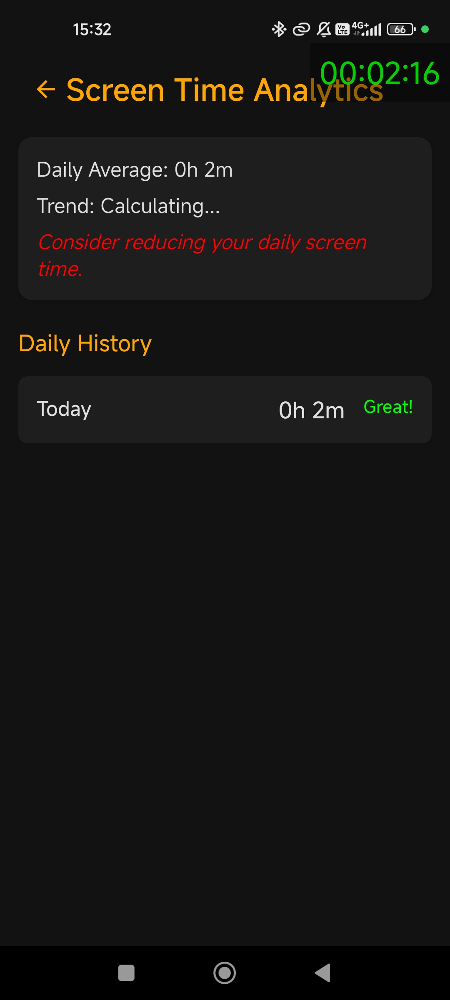

# Awareen - Screen Time Awareness App

**Awareen** (Awareness + Screen) is an Android application that helps users become more aware of their screen time through a persistent overlay timer. The app displays your current screen time in real-time, even when using other applications, promoting mindful device usage.

## Features

- **Persistent Overlay Timer**: Always-visible screen time counter that works across all apps
- **Customizable Display**: Adjustable colors, positions, and font sizes for each level
- **Smart Display Modes**: Choose between always-on or interval-based timer display
- **Analytics Dashboard**: Track your daily screen time patterns and trends
- **Auto-Reset**: Configurable daily reset time for screen time tracking

## Screenshots

<p align="center">
  
  
  
  
</p>

## How It Works

### Three-Level System

1. **Level 1 (Green)**: Default display for normal usage (0-60 minutes)
2. **Level 2 (Yellow)**: Warning phase when approaching time limits (60-120 minutes)
3. **Level 3 (Red)**: Alert phase for excessive usage (120+ minutes)

> Colors and time thresholds are fully customizable in the settings.

### Display Modes

- **Always Mode**: Timer constantly visible on screen
- **Interval Mode**: Timer appears periodically (configurable intervals)

## Technical Stack

- **Language**: Kotlin
- **Min SDK**: 26 (Android 8.0)
- **Target SDK**: 35 (Android 15)
- **Architecture**: Service-based with overlay permissions

## Prerequisites

- Android 8.0 (API level 26) or higher
- Overlay permission (System Alert Window)
- App-pausing permission
- Battery optimization exemption (recommended)
- Auto-start permission (recommended)

## Installation

1. **Clone the repository**

   ```bash
   git clone https://github.com/andebugulin/awareen.git
   cd awareen
   ```

2. **Open in Android Studio**

   - Import the project into Android Studio
   - Sync Gradle files

3. **Build and Install**
   - Just use android studio builder, its the simplest
   - Go to build, then generate signed app bundle or APK, follow the steps

## Usage

1. **Grant Permissions**:

   - Launch Awareen
   - Press "Start Service" to request necessary permissions

2. **Customize Settings**:

   - Access settings through the gear icon
   - Adjust colors, positions, and time thresholds
   - Configure display modes and reset times

3. **View Analytics**:
   - Check your usage patterns in the Analytics section
   - Track daily screen time trends

## Configuration

### In my opinion, best Settings

- **Level 1**: 60 minutes (color - #6F48A7, Top Right, 22sp, blinking enabled)
- **Level 2**: 60 minutes duration (#A8CC58, Top Left, 23sp, blinking enabled)
- **Level 3**: Unlimited (#A3F5C8, Top Center, 33sp, blinking enabled)
- **Reset Time**: Midnight (00:00)
- **Display Mode**: Interval each minute for 8 seconds

### Customization Options

- Timer colors and positions for each level
- Font sizes (adjustable per level)
- Time thresholds for level transitions
- Display intervals and durations
- Daily reset timing
- Blinking alerts (I higly recommend it)

## Project Structure

The code is split into four packages by responsibility — `ui` talks to `service`, `service` talks to `data`, and `overlay` is a small shared domain used by both.

```
app/src/main/
├── java/com/andebugulin/awareen/
│   ├── data/
│   │   ├── AppSettings.kt           # Pref keys + defaults + broadcast action
│   │   ├── ScreenTimeRepository.kt  # Daily totals, reset bookkeeping, analytics I/O
│   │   └── SettingsRepository.kt    # Per-level settings I/O + settings-updated broadcast
│   ├── overlay/
│   │   ├── OverlayController.kt     # WindowManager overlay, touch handler, render()
│   │   └── OverlaySettings.kt       # Immutable view-config data classes
│   ├── service/
│   │   ├── ScreenTimeService.kt     # Foreground service + 1s tick loop coordinator
│   │   ├── ResetScheduler.kt        # Wall-clock math + AlarmManager (Doze-proof)
│   │   ├── ScreenStateMonitor.kt    # PowerManager + KeyguardManager wrapper
│   │   └── BootReceiver.kt          # Starts the service on BOOT_COMPLETED
│   └── ui/
│       ├── MainActivity.kt          # Start/stop + navigation + defensive reset check
│       ├── PermissionWizard.kt      # 4-step permission state machine
│       ├── SettingsActivity.kt      # Per-level UI + JSON export/import
│       ├── AnalyticsActivity.kt     # Daily/hourly RecyclerView + JSON export/import
│       ├── InfoActivity.kt          # About screen
│       ├── UnsavedChangesDialog.kt  # Custom dialog used by SettingsActivity
│       └── Colorpickerview.kt       # HSV color picker custom view
├── res/
│   ├── layout/                      # UI layouts
│   ├── drawable/                    # Icons and graphics
│   ├── values/                      # Strings, colors, themes
│   └── xml/                         # Backup and data rules
└── AndroidManifest.xml              # App permissions and components
```

See `CLAUDE.md` for a fuller walkthrough of the architecture, the settings broadcast flow, and SharedPreferences key conventions.

## Permissions

```
   <!-- Overlay permissions -->
    <uses-permission android:name="android.permission.SYSTEM_ALERT_WINDOW" />

    <!-- Boot and startup permissions -->
    <uses-permission android:name="android.permission.RECEIVE_BOOT_COMPLETED" />

    <!-- Foreground service permissions -->
    <uses-permission android:name="android.permission.FOREGROUND_SERVICE" />
    <uses-permission android:name="android.permission.FOREGROUND_SERVICE_DATA_SYNC" />

    <!-- Doze-proof daily reset -->
    <uses-permission android:name="android.permission.SCHEDULE_EXACT_ALARM" />

    <!-- Keep service alive -->
    <uses-permission android:name="android.permission.REQUEST_IGNORE_BATTERY_OPTIMIZATIONS" />

    <!-- Foreground-service notification (Android 13+) -->
    <uses-permission android:name="android.permission.POST_NOTIFICATIONS" />
```

## Troubleshooting

### Common Issues

**Timer stops working**:

- Check if overlay permission is granted
- Disable battery optimization for Awareen
- Ensure the app pause is disabled

## 🤝 Contributing

1. Fork the repository
2. Create a feature branch (`git checkout -b feature/amazing-feature`)
3. Commit changes (`git commit -m 'Add amazing feature'`)
4. Push to branch (`git push origin feature/amazing-feature`)
5. Open a Pull Request

## Author

**Andrei Gulin**

- GitHub: [@Andebugulin](https://github.com/Andebugulin)
- LinkedIn: [Andrei Gulin](https://www.linkedin.com/in/andrei-gulin)

## Support My Work

If you find this app useful, consider supporting me:

<a href="https://www.buymeacoffee.com/andebugulin">
  
</a>

## Connect with Me

- [GitHub](https://github.com/Andebugulin)
- [LinkedIn](https://www.linkedin.com/in/andrei-gulin)

## License

This project is licensed under the MIT License - see the LICENSE file for details.

---

### `Download`

<div style="text-align: center; margin: 40px 0;">
  <a href="https://play.google.com/store/apps/details?id=com.andebugulin.awareen2" target="_blank">
    
  </a>
</div>
