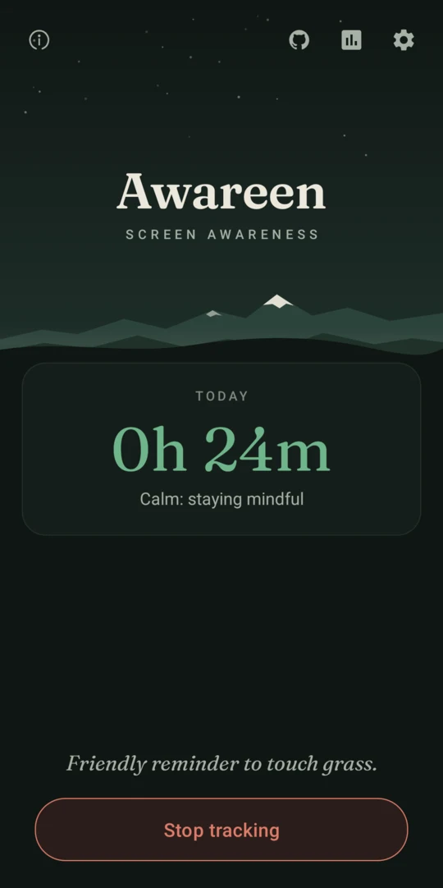
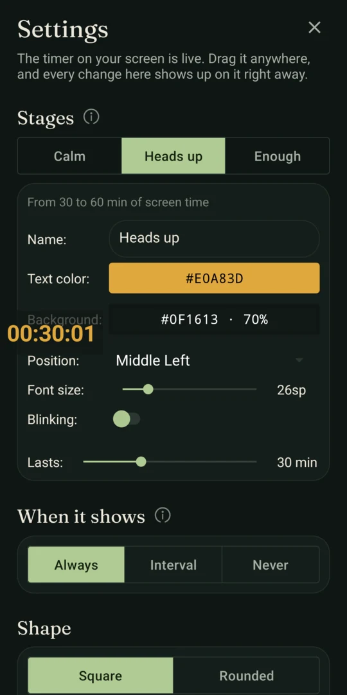
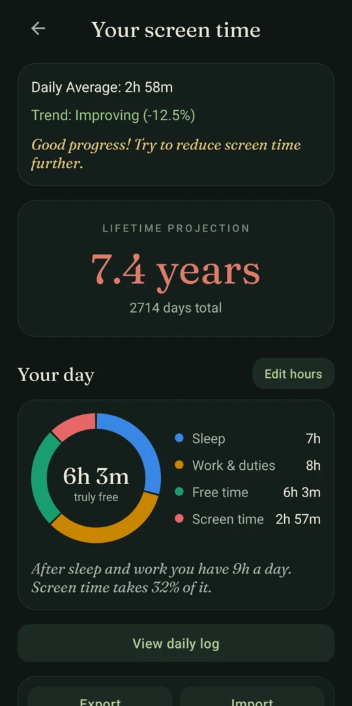

<p align="center">
  
</p>

<h1 align="center">Awareen</h1>

<p align="center"><b>Screen awareness.</b> A quiet timer that floats over every app and shows how long you have been on your phone today.</p>

<p align="center">
  <a href="https://play.google.com/store/apps/details?id=com.andebugulin.awareen2"></a>
</p>

<p align="center">
  <a href="https://andebugulin.github.io/Awareen/">Website</a> ·
  <a href="https://github.com/Andebugulin/Awareen/releases/latest">Download the APK</a>
</p>

<p align="center">
  
  
  
</p>

No blocking, no nagging. Awareen (awareness plus screen) shows you the number and trusts you with it. No ads, no account, and no internet permission, so your screen time never leaves your phone.

## Features

* **A timer over any app.** Show it all the time, or for a few seconds every minute, or never.
* **Tap to hide, drag anywhere.** Tap the timer to hide it for 5 seconds. Drag it and it stays where you put it.
* **Three stages.** Each with its own name, text and background color, position, size and optional blinking.
* **Live settings.** Every change applies the moment you make it, with a preview of the timer on screen.
* **Your day.** Analytics splits 24 hours into sleep, work, free time and screen time, next to your daily average, trend and a lifetime projection.
* **A daily reset you can trust.** At the time you choose, even when the phone is asleep.
* **Home screen widget.** Today's time at a glance, colored by stage. Pairs well with the Never display mode.
* **Export and import.** Settings and history move to a new phone as JSON files.

## How it works

The timer moves through three stages as your day goes on:

| Stage | Default color | Default time |
|---|---|---|
| **Calm** | green | the first 30 minutes |
| **Heads up** | amber | the next 30 minutes |
| **Enough** | red, blinking | until the daily reset |

Names, colors and times are all yours to change in Settings.

## Requirements

* Android 8.0 (API 26) or newer, targets Android 16 (API 36)
* Permission to display over other apps, which is the timer itself
* Recommended: no battery optimization, app pausing off, and auto start on phones that have it. The app walks you through these when you press Start tracking.

## Building

```bash
git clone https://github.com/Andebugulin/Awareen.git
cd Awareen
./gradlew installDebug
```

Or open the project in Android Studio and press Run. Release signing and the Play upload are described in `PLAY_RELEASE.md`.

## Project structure

Plain Android Views and Kotlin, one SharedPreferences file, no database and no DI framework. `ui` talks to `service`, `service` talks to `data`, and `overlay` is shared by both.

```
app/src/main/java/com/andebugulin/awareen/
  data/      AppSettings (keys and defaults), ScreenTimeRepository, SettingsRepository
  domain/    Pure logic: analytics keys, overlay decisions, reset math
  overlay/   OverlayController (the floating timer) and OverlaySettings
  service/   ScreenTimeService (1 second tick), ResetScheduler, ScreenStateMonitor, BootReceiver
  widget/    ScreenTimeWidgetProvider
  ui/        MainActivity, SettingsActivity, AnalyticsActivity, InfoActivity,
             PermissionWizard, DaySplitChartView, ColorPickerView
```

The artwork (home scene, logo, launcher icon and the website scene) comes from `scripts/generate_scenery.py`. See `CLAUDE.md` for a fuller walkthrough of the architecture, the settings broadcast and the reset flow.

## Troubleshooting

**The timer stops after a while.** Check that display over other apps is still allowed, turn off battery optimization for Awareen, and turn off "Pause app activity if unused".

## Contributing

Issues and pull requests are welcome. Fork the repository, make your change on a branch, and open a pull request.

## Author

**Andrei Gulin**, [GitHub](https://github.com/Andebugulin) and [LinkedIn](https://www.linkedin.com/in/andrei-gulin)

If Awareen helps you, you can [buy me a coffee](https://www.buymeacoffee.com/andebugulin).

## License

MIT
